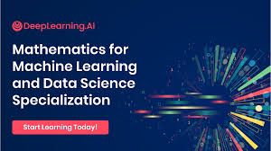

# 📘 Mathematics for Machine Learning and Data Science Specialization

Welcome to the **Mathematics for Machine Learning and Data Science Specialization** repository!  
This repo contains notes, code, and resources from the [DeepLearning.AI](https://www.deeplearning.ai/) specialization offered on [Coursera](https://www.coursera.org/specializations/mathematics-machine-learning) — an essential series for anyone diving into the mathematical foundations of machine learning and data science.

---

## 🧠 About the Specialization

This specialization is designed to equip learners with the mathematical tools needed to understand and build machine learning algorithms. It covers the core mathematical principles that underpin key ML concepts and prepares you for advanced topics in AI and data science.

### 📚 Courses Included:
1. **Linear Algebra for Machine Learning and Data Science**  
2. **Calculus for Machine Learning and Data Science**  
3. **Probability and Statistics for Machine Learning and Data Science**

